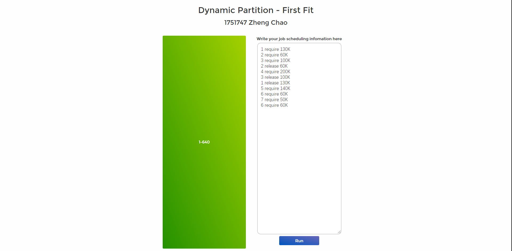
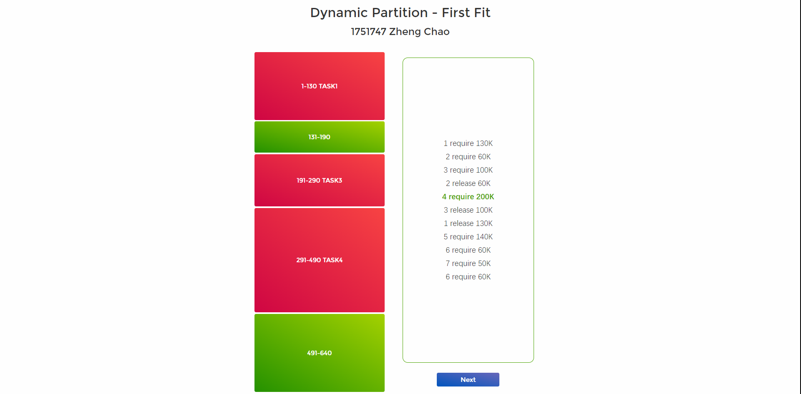
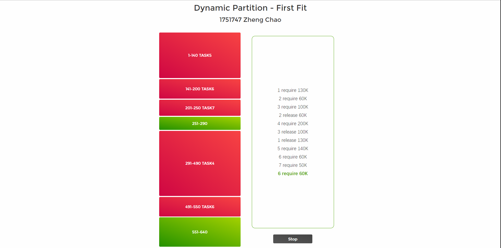
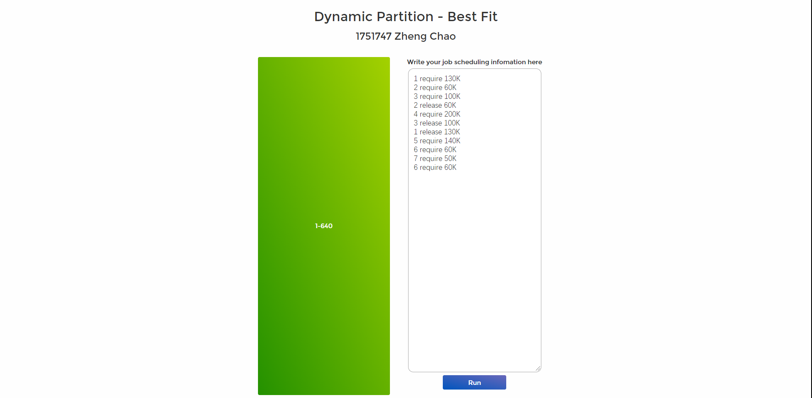
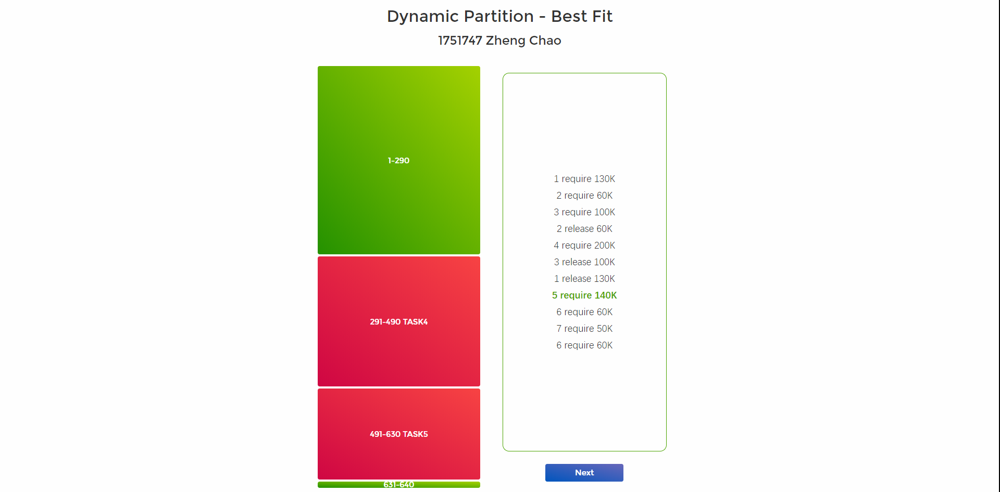
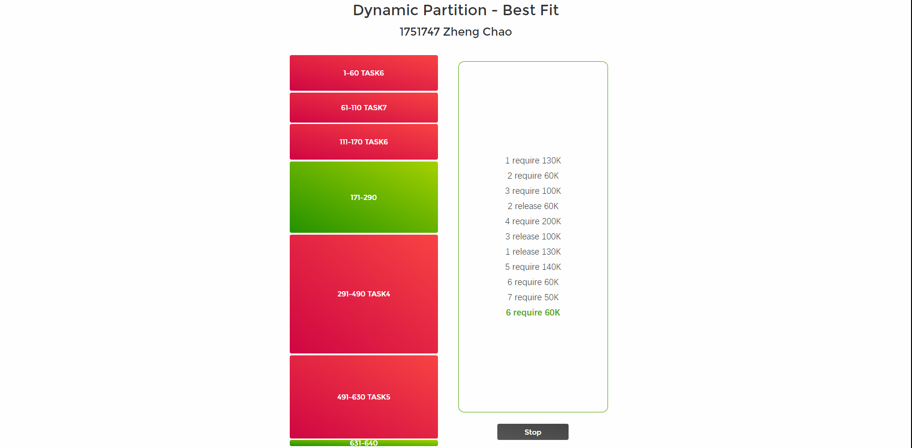

# 动态分区内存管理
### 郑超 1751747
## 程序使用说明
打开index.html，选择首次适应算法/最佳适应算法，跳转至新页面。

可根据格式在右侧input框内输入作业的内存要求信息，点击run即可允许。

默认内存空间大小为640K。
## 设计文档
### 总体思路
**首次适应算法（First-fit）**

该算法从空闲分区链首开始查找，直至找到一个能满足其大小要求的空闲分区。然后再按照作业的大小，从该分区中划出一块内存分配给请求者，余下的空闲分区仍留在空闲分区中。

**最佳适应算法（Bset-fit）**

该算法要将所有的空闲区按大小排序，以递增顺序形成一个空白链。每次找到的第一个满足要求的空闲区，就是“满足要求下最小的空闲区”。

### 代码目录
```css
- js
  - dispatch.js         #处理前端逻辑和UI的展现
  - first-fit.js        #首次适应算法
  - best-fit.js         #最佳适应算法 实际上只需要响应require和release的两个请求
- pic
- src
- index.html            #起始页面
- main.html             #适应算法展示页面
- main.css              #适应算法展示页面的css文件
- main.js               #汇集适应算法展示页面的所有js代码的文件
```
## 实现
### 起始页面（index.html）

### 首次适应算法模拟页面
右侧可编辑内存管理需求列表。点击Run开始运行。



每次点击Next按钮都执行一个任务，右侧高亮显示当前任务执行的是那一步。左侧绿色表示空闲分区，红色表示被作业任务占据的分区，并且标出了执行作业的标识。



首次适应算法执行完毕。


### 最佳适应算法
执行前。



执行中。



执行完毕。

